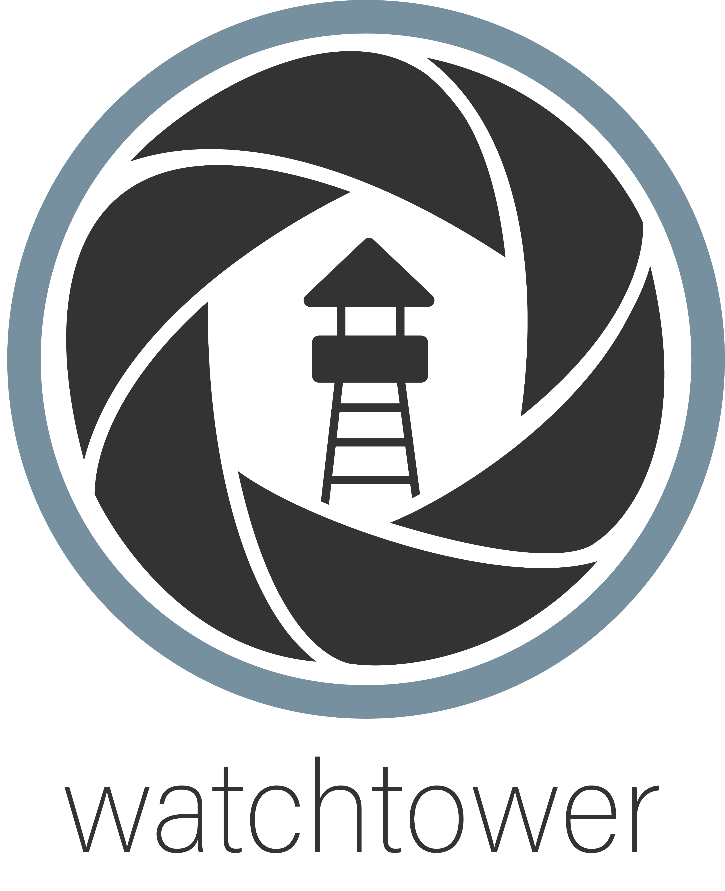
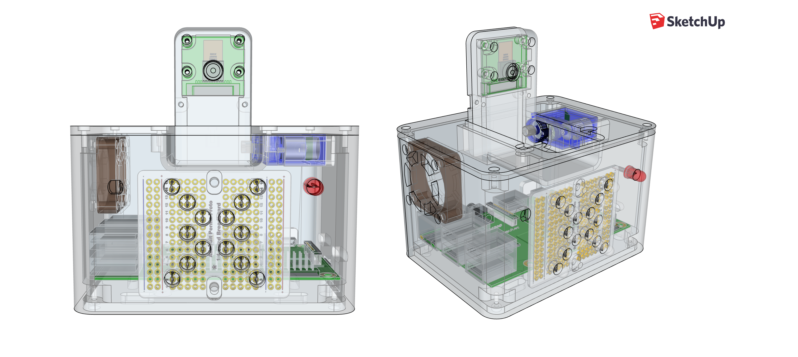
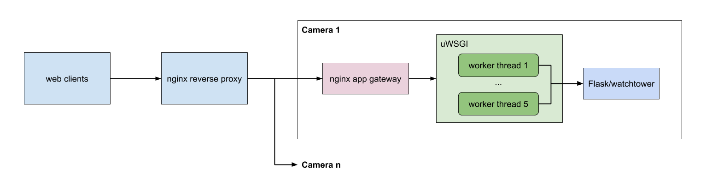
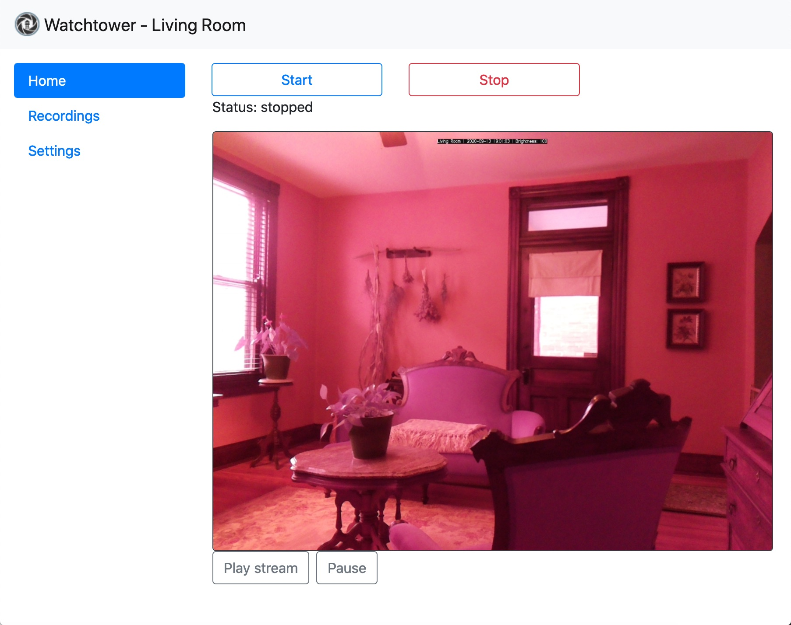
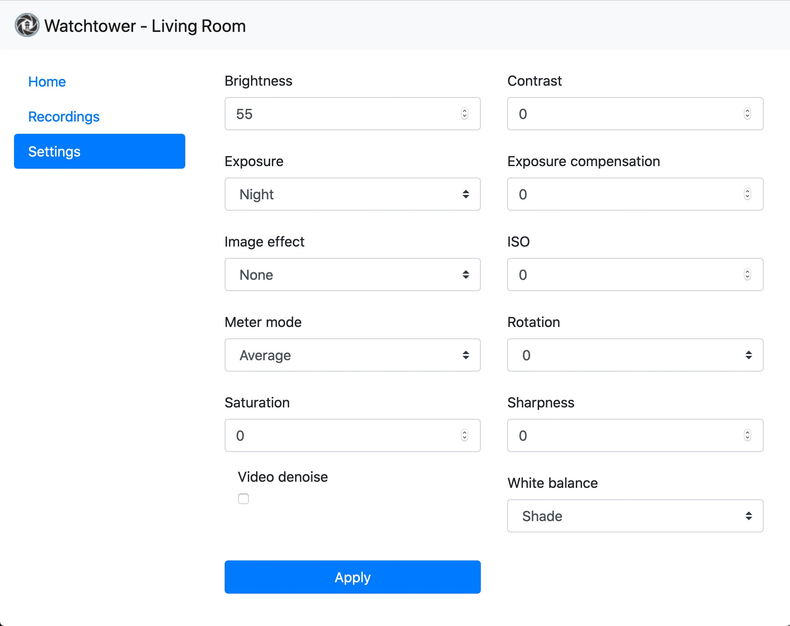

  

    

### Overview

Watchtower turns your Raspberry Pi into a DIY security camera. Put as many cameras as you want on your network and each instance will independently scan for motion and, when triggered, will save a recording to disk in the h264 format and upload an encrypted copy to Dropbox.

The central package that runs on each Raspberry Pi is named [watchtower](watchtower). It's a Python 3 Flask app with API endpoints that allow you to start and stop monitoring, stream via MJPEG, record, download and delete recordings, and tweak camera settings. See [api.md](./api.md) for API documentation. There is also an optional web app that provides a graphical interface for these APIs.

Watchtower was designed to take advantage of the capabilities of the Pi NoIR camera. An optional program for a microcontroller is included to read analog room brightness, control infrared LED intensity for night vision, move an optional servo, and communicate with Watchtower over the Raspberry Pi's GPIO ports.

A 3D case for the system is located in [ancillary/case/](ancillary/case/). This case houses the Raspberry Pi, camera, microcontroller, servo, IR LEDs, fan, and more. A Fritzing diagram of the case's internal hardware is included in [ancillary/hardware/](ancillary/hardware).

    

### Server setup

A [uWSGI configuration file](wsgi.ini) is included that will start the Watchtower Flask app and allow up to 5 simultaneous network connections. An nginx configuration file is included in [ancillary/nginx/app_gateway](ancillary/nginx/app_gateway) to run uWSGI behind nginx and proxy all requests to the uWSGI instance.

A second nginx configuration file is included in [ancillary/nginx/reverse_proxy](ancillary/nginx/reverse_proxy) for the main server that will handle traffic from the internet. This is deisgned to proxy all requests to one of the upstream nginx servers running Watchtower.

Both the reverse proxy and the upstream app gateway configurations encrypt all traffic and perform x509 client certificate authorization.

---

There is an included [install script](install.sh) for Raspbian Buster that will set up a simple Watchtower instance and place it behind a firewall. The final steps outside of the script's scope are creating your SSL certificates for the web API, configuring the public-facing nginx reverse proxy, and fine-tuning your Watchtower config file for Dropbox and microcontroller support.

The rest of this readme breaks down each Watchtower component and describes its configuration located in [watchtower_config.json](watchtower/config/watchtower_config_example.json).
 1. [API endpoints](./api.md)
 3. [Front-end web app](#2-motion-detection)
 3. [Motion detection](#2-motion-detection)
 4. [Optional Dropbox file upload](#3-optional-dropbox-file-upload)
 5. [Optional microcontroller](#4-optional-microcontroller-infrared-and-servos)
 
 ---

### 1. API Endpoints

 Moved to [api.md](./api.md).

### 2. Front-end web app

An optional web app for each Watchtower instance can be enabled. You can access it in a browser through the reverse proxy by going to `https://proxy_address/camera0/`. This provides a simple interface for Watchtower built with [Bootstrap](https://getbootstrap.com/). 

The web app is broken into sections:
- The Home section lets you view the camera stream and toggle the monitoring status.
- The Recordings section displays a listing of all recordings that the Watchtower instance has saved. It allows you to delete and download individual recordings.
- The Settings section lets you tweak and save various settings of the Pi camera hardware.

| Home | Recordings | Settings |
| --- | --- | --- |
|  |  | |

  
<b>Configuration</b>

  
There is only a single configuration option for the web app in the config file. Omit or set `WEB_APP_ENABLED` to false to turn off the web app. When disabled, requests to load the app will 404.

### 3. Motion Detection

Motion is detected using background subtraction in [watchtower/motion/motion_detector.py](watchtower/motion/motion_detector.py). The implementation is based heavily on [this article](https://www.pyimagesearch.com/2015/05/25/basic-motion-detection-and-tracking-with-python-and-opencv/). A blurred grayscale image of the current camera frame is generated and subtracted from a static image of the scene. If a large enough area of pixels has significantly changed, it triggers a motion event and the area is outlined in a JPEG. This image will be saved along with the video.

  
<b>Configuration</b>

  
All motion properties are prefixed with `MOTION_` in the config file:
- `MAX_EVENT_TIME` is the maximum number of seconds for a single recording before a new base frame is selected. This is a failsafe to avoid infinitely recording in the event that the scene is permanently altered.
- `MIN_TRIGGER_AREA` the minimum percentage (represented as a float between 0 and 1) of the image that must be detected as motion before a motion event is triggered.
- `SENSITIVITY` the sensitivty between 0 and 1 when detecting motion. This affects the comparision between the base frame and the current frame when detecting pixel color deltas that are over a threshold. The closer to 1, the more sensitive motion detection will be and the more motion events you will have.
- `RECORDING_PADDING` the number of seconds to record before and after motion occurs.

### 4. Optional Dropbox File Upload

Video files are sent to Dropbox in small chunks as soon as motion is detected. Because the bytes of the stream are broken into files, the files are not cleanly separated by header frames. For smooth playback, the data will need to be concatenated into a single file. To help with this, a shell script located at [ancillary/mp4_wrapper.sh](ancillary/mp4_wrapper.sh) will combine the videos for each motion event into one file and will convert the h264 format into mp4 using [MP4Box](https://gpac.wp.imt.fr/mp4box/). MP4Box only needs to be installed on the machine that opens recordings from Dropbox; no need to install it alongside any Watchtower instance.

The video files uploaded to Dropbox can be encrypted using symmetric key encryption. All you need to do is supply a path in the config file to a public asymmetric encryption key in PEM format. When this path is supplied, a symmetric [Fernet](https://cryptography.io/en/latest/fernet/) key is generated for each file uploaded. This new key will be used to encrypt the contents of its file and then it will itself be encrypted using the supplied public key. This encrypted key is base64 encoded and padded onto the beginning of the Dropbox file. The resulting file data has the format: `{key_length_int} {encoded_and_encrypted_key}{encrypted_data}`. [mp4_wrapper.sh](ancillary/mp4_wrapper.sh) can accept a path to the asymmetric private key and will automatically decrypt the files before stitching them together and converting the final video to an mp4.

  
<b>Configuration</b>

All Dropbox properties are prefixed with `DROPBOX_` in the config file. Dropbox can be disabled by deleting all items prefixed wtih `DROPBOX_`.
- `FILE_CHUNK_MB` determines the maximum file size in megabytes that will be uploaded to Dropbox. Files are saved in series using the name `video#.h264` like `video0.h264`, `video1.h264`, etc.
- `API_TOKEN` is the Dropbox API token for your account.
- `PUBLIC_KEY_PATH` the path to the public asymmetric key. If `null` is supplied, the Dropbox files are not encrypted.

### 5. Optional Microcontroller, Infrared, and Servos

The project can be optionally configured to work with a microcontroller to enable and disable infrared lighting for night vision. The controller also reads the analog room brightness and uses PWM to fine-tune the infrared brightness. In the event that the camera should rotate or be covered when not in use, this controller can also move an attached servo. A diagram for the microcontroller circuit [is included](/ancillary/hardware).

I used an AVR ATTiny84 for its small size and low price. This microcontroller has more than enough IO ports for Watchtower and it comes with a second internal timer that can be dedicated for servo usage.

The ATTiny84 program located in [ancillary/hardware/controller/controller.ino](ancillary/hardware/controller/controller.ino) is configured to communicate serially with Watchtower. This program along with the [TinyServo](ancillary/hardware/controller/TinyServo.h) library consumes about 3.6KB of program space if link time optimization (LTO) is used, and about 4.5KB without LTO. Either approach works fine with the ATTiny84's 8KB of program space. [ATTinyCore](https://github.com/SpenceKonde/ATTinyCore) is a great project that you can use with the Arduino IDE to program the ATTiny microcontroller.

The serial connection inside Watchtower is operated by [watchtower/remote/microcontroller_comm.py](watchtower/remote/microcontroller_comm.py). This module is also configured to read the room brightness value from the serial connection, which will be displayed in the camera's annotation area along with the camera name and the current time.

  
<b>Configuration</b>

All microcontroller properties are prefixed with `MICRO_` in the config file:
- `ENABLED` - if `false`, the `microcontroller_comm` module will be not be used and the following config fields are ignored.
- `BAUDRATE` is the baudrate of the serial connection to the microcontroller.
- `PORT` is the location of the serial connection, like `/dev/serial0` on Raspbian.
- `TRANSMISSION_FREQ` the frequency as "messages per second" that transmissions can be sent or received to and from the microcontroller. With the default implementation of [controller.ino](ancillary/hardware/controller/controller.ino), a value of 2 is good.
- `SERVO_ANGLE_ON` the angle (from 0-180) of the servo for the on state.
- `SERVO_ANGLE_OFF` the angle (from 0-180) of the servo for the off state.

