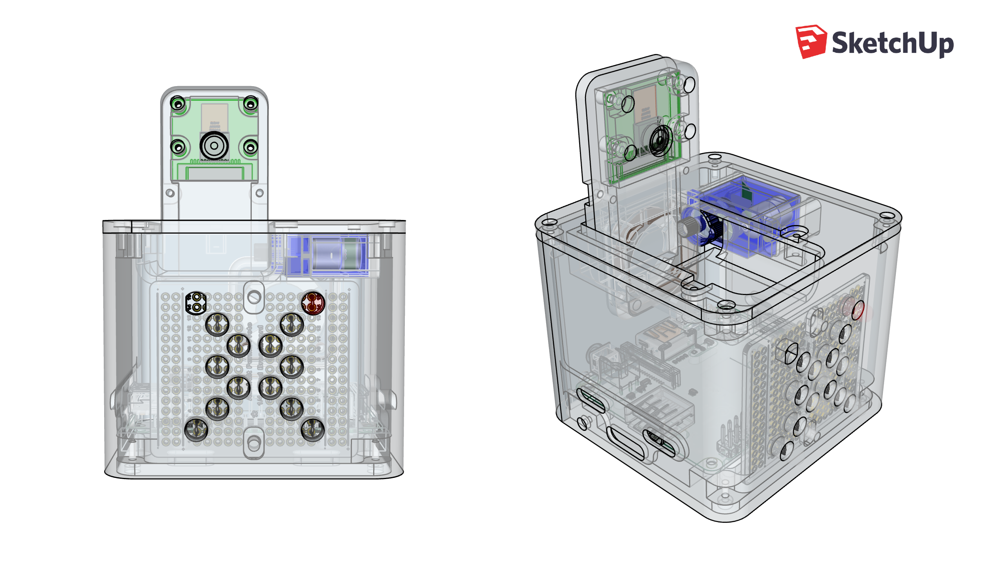
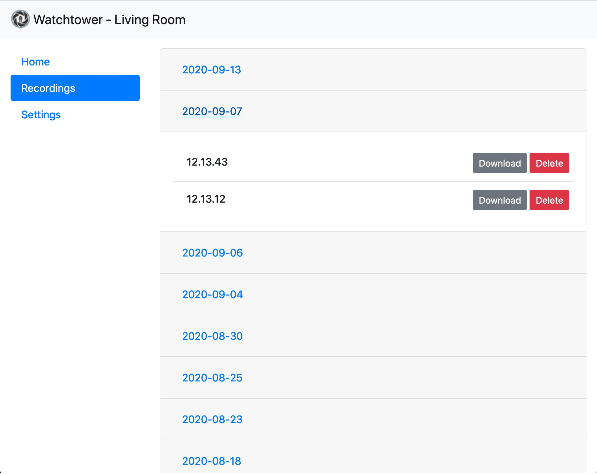

  

    

### Overview

Watchtower turns your Raspberry Pi into a DIY security camera. Watchtower scans for motion and, when triggered, will save a recording to disk in the h264 format and upload an encrypted copy to Dropbox. You can record to these destinations using different resolutions, which allows you to simultaneously record the full HD video to disk while recording a lower-resolution version to Dropbox.

The central [watchtower](watchtower) package is a Python 3 Flask app powered by uWSGI. It has API endpoints that allow you to start and stop monitoring, stream via MJPEG, record, download and delete recordings, and tweak camera settings. See [api.md](./api.md) for API documentation. This package also has an optional web app that provides a graphical interface for these APIs.

Watchtower was designed to take advantage of the Pi NoIR camera. An optional program for a microcontroller is included to read analog room brightness, control infrared LED intensity for night vision, move an optional servo, and communicate with Watchtower's microcontroller process using the Raspberry Pi's GPIO ports.

A 3D case for the system is located in [ancillary/case/](ancillary/case/). This case houses the Raspberry Pi, camera, microcontroller, servo, IR LEDs, fan, and more. A Fritzing diagram of the case's internal hardware is included in [ancillary/hardware/](ancillary/hardware).

    

### Setup

The Watchtower project is composed of multiple Docker containers that each carry out a specific function:
- the `app` container runs the main Watchtower package
- the `server` container runs an nginx app gateway and proxies requests to the `app` container
- the `mc_server` container communicates over a serial connection with an optional microcontroller
- the `icebox` container monitors the SoC temperature and controls an optional cooling fan via GPIO

_No container runs privileged as root. Only the minimum required access is provided to each container._

There is an included [install script](install.sh) for Raspberry Pi OS Lite that will set up the Watchtower application and place it behind a firewall. The install script only needs to be run once. After running, open a new shell session and run `docker-compose build` to build all of the containers. Finally, run `sudo systemctl start watchtower` to start the application.

The final (and optional) steps outside of the script's scope are creating your SSL certificates for the web API, configuring the public-facing nginx reverse proxy, and fine-tuning your Watchtower config file for Dropbox and microcontroller support.

The nginx configuration file included in [ancillary/nginx/reverse_proxy](ancillary/nginx/reverse_proxy) is for the main server that will handle traffic from the internet. This is deisgned to proxy all requests to one of the upstream nginx servers running Watchtower.

Both the reverse proxy and the upstream app gateway configurations encrypt all traffic and perform x509 client certificate authorization.

---

The rest of this readme breaks down each Watchtower component and describes its configuration. The two main configuration files are [config/watchtower_config.json](config/watchtower_config_example.json) and the [.env](.env) file.
 1. [API endpoints](./api.md)
 2. [Front-end web app](#2-front-end-web-app)
 3. [Motion detection](#3-motion-detection)
 4. [Optional Dropbox file upload](#4-optional-dropbox-file-upload)
 5. [Optional microcontroller](#5-optional-microcontroller-infrared-and-servos)

### 1. API Endpoints

 Moved to [api.md](./api.md).

### 2. Front-end web app

An optional web app for each Pi's Watchtower instance can be enabled. You can access it in a browser through the reverse proxy by going to `https://proxy_address/camera0/`. This provides a simple interface for Watchtower built with [Bootstrap](https://getbootstrap.com/). 

The web app is broken into sections:
- The Home section lets you view the camera stream and toggle the monitoring status.
- The Recordings section displays a listing of all recordings that the Watchtower instance has saved. It allows you to delete and download individual recordings.
- The Settings section lets you tweak and save various settings of the Pi camera hardware.

| Home | Recordings | Settings |
| --- | --- | --- |
|  |  | |

  
<b>Configuration</b>

  
There is only a single configuration option for the web app in the config JSON file. Omit or set `WEB_APP_ENABLED` to false to turn off the web app. When disabled, requests to load the app will 404.

### 3. Motion Detection

Frames from the camera feed are constantly monitored for changes. If a large enough area of pixels has significantly changed, a motion event is triggered and the motion area is outlined in a JPEG. This JPEG will be saved along with the h264 video.

  
<b>Configuration</b>

  
All motion properties are prefixed with `MOTION_` in the config JSON file:
- `MAX_EVENT_TIME` is the maximum number of seconds for a single recording before a new base/reference frame is selected. This is a failsafe to avoid infinitely recording in the event that the scene is permanently altered.
- `MIN_TRIGGER_AREA` the minimum percentage (represented as a float between 0 and 1) of the image that must be detected as motion before a motion event is triggered.
- `SENSITIVITY` the sensitivty between 0 and 1 when detecting motion. This affects the comparision between the reference frame and the current frame when detecting pixel color deltas that are over a threshold. The closer to 1, the more sensitive motion detection will be.
- `RECORDING_PADDING` the number of seconds to record before and after motion occurs.

### 4. Optional Dropbox File Upload

Video files are sent to Dropbox in small chunks as soon as motion is detected. For playback, the data will need to be concatenated into a single file. To help with this, a shell script located at [ancillary/mp4_wrapper.sh](ancillary/mp4_wrapper.sh) will combine the videos for each motion event into one file and will convert the h264 format into mp4 using [MP4Box](https://gpac.wp.imt.fr/mp4box/). MP4Box only needs to be installed on the machine that opens recordings from Dropbox; no need to install it alongside any Watchtower instance.

The video files uploaded to Dropbox can be encrypted using symmetric key encryption. Simply supply a path in the config JSON file to a public asymmetric encryption key in PEM format. When this path is supplied, a symmetric [Fernet](https://cryptography.io/en/latest/fernet/) key is generated for each file uploaded. This new key will be used to encrypt the contents of its file and then it will itself be encrypted using the supplied public key. This encrypted key is base64 encoded and padded onto the beginning of the Dropbox file. The resulting file data has the format: `{key_length_int} {encoded_and_encrypted_key}{encrypted_data}`. [mp4_wrapper.sh](ancillary/mp4_wrapper.sh) can accept a path to the asymmetric private key and will automatically decrypt the files before stitching them together and converting the final video to an mp4.

  
<b>Configuration</b>

All Dropbox properties are contained inside the `dropbox` key of the `DESTINATIONS` object in the config JSON file. Dropbox can be disabled by deleting the `dropbox` entry.
- `file_chunk_kb` determines the maximum file size in kilobytes that will be uploaded to Dropbox. Files are saved in series using the name `video#.h264` like `video0.h264`, `video1.h264`, etc.
- `token` is the Dropbox API token for your account.
- `public_key_path` the path to the public asymmetric key. If `null` is supplied or this field is omitted, the Dropbox files are not encrypted.
- `size` is an array containing the width and height of the videos saved to Dropbox. This is useful for specifying a smaller size for Dropbox, saving storage and network resources. 

### 5. Optional Microcontroller, Infrared, and Servos

The project can be optionally configured to work with a microcontroller to enable and disable infrared lighting for night vision. The controller also reads the analog room brightness and uses pulse-width modulation to fine-tune the infrared brightness. The brightness will be displayed in the camera's annotation area along with the camera name and the current time. In the event that the camera should rotate or be covered when not in use, this controller can also move an attached servo. A diagram for the microcontroller circuit [is included](/ancillary/hardware).

I used an AVR ATTiny84 for its small size and low price. This microcontroller has more than enough IO ports for Watchtower and it comes with a second internal timer that can be dedicated for 50Hz servo usage.

The ATTiny84 program located in [microcontroller/arduino/controller.ino](microcontroller/arduino/controller.ino) is configured to communicate serially with the `mc_server` Docker container. Along with the [TinyServo](microcontroller/arduino/TinyServo.h) library, the AVR program consumes about 3.6KB of program space if link time optimization (LTO) is used, and about 4.5KB without LTO. Either approach works fine with the ATTiny84's 8KB of program space. [ATTinyCore](https://github.com/SpenceKonde/ATTinyCore) is a great project that you can use with the Arduino IDE to program the ATTiny microcontroller. The [hardware section](ancillary/hardware) describes how to program the ATTiny84 with ICSP using the Raspberry Pi. This allows you to reprogram the microcontroller without disassembling the case. The necessary connections for this are included in the circuit diagram.

  
<b>Configuration</b>

The two configurations in the config JSON file are:
- `SERVO_ANGLE_ON` the angle (from 0-180) of the servo for the on state.
- `SERVO_ANGLE_OFF` the angle (from 0-180) of the servo for the off state.

The rest are configurations are located in the [.env](.env) file:

- `SERIAL_ENABLED` if `0`, the `mc_server` Docker container will not be used.
- `SERIAL_BAUD` is the baud rate of the serial connection with the microcontroller.
- `SERIAL_DEVICE` is the location of the serial connection, like `/dev/serial0` on Raspberry Pi OS.
- `MC_SERVER_PORT` is the port number used for the Watchtower container to communicate with the microcontroller container. This should not need to be changed.

