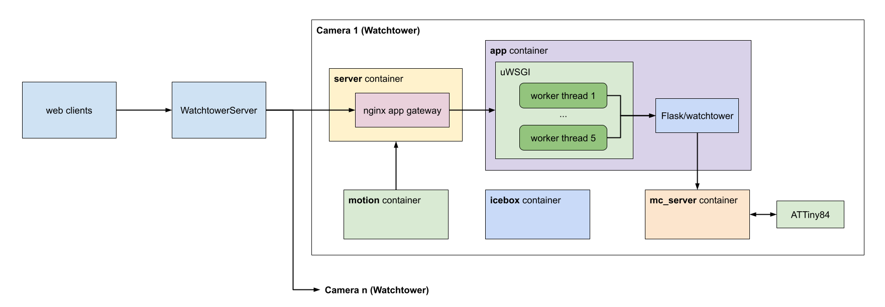

  

    

### Overview

Watchtower turns your Raspberry Pi into a DIY security camera. Put as many cameras as you want on your network and each instance will independently scan for motion and, when triggered, will save a recording to disk in the h264 format and upload an encrypted copy to Dropbox.

The central package that runs on each Raspberry Pi is named [watchtower](watchtower). It's a Python 3 Flask app with API endpoints that allow you to start and stop monitoring, stream via MJPEG, manually record, and request the status of the Watchtower instance.

Watchtower was designed to take advantage of the capabilities of the Pi NoIR camera. An optional Arduino program is included to read analog room brightness, control infrared LED intensity for night vision, and communicate with Watchtower over the Raspberry Pi's GPIO ports.

A sample case model for the system is located in [ancillary/case/](ancillary/case/). This case houses the Raspberry Pi, camera, Arduino, servo, array of IR LEDs, photoresistor, and status LED. A Fritzing prototype of the case's internal hardware is included in [ancillary/arduino/](ancillary/arduino).

    

### Server setup

A [uWSGI configuration file](wsgi.ini) is included that will start the Watchtower Flask app and allow up to 5 simultaneous network connections. An nginx configuration file is included in [ancillary/nginx/app_gateway](ancillary/nginx/app_gateway) to run uWSGI behind nginx and proxy all requests to the uWSGI instance.

A second nginx configuration file is included in [ancillary/nginx/reverse_proxy](ancillary/nginx/reverse_proxy) for the main server that will handle traffic from the internet. This is deisgned to proxy all requests to one of the upstream nginx servers running Watchtower.

Both the reverse proxy and the upstream app gateway configurations encrypt all traffic and perform x509 client certificate authorization.

---

There is an included [install script](install.sh) for Raspbian Buster that will set up a simple Watchtower instance and place it behind a firewall. The final steps outside of the script's scope are creating your SSL certificates for the web API, configuring the nginx reverse proxy, and fine-tuning your Watchtower config file for Dropbox, servo, and Arduino support.

The rest of this readme breaks down each Watchtower component and describes its configuration located in [watchtower_config.json](watchtower/config/watchtower_config_example.json).
 1. [API endpoints](#1-api-endpoints)
 2. [Motion detection](#2-motion-detection)
 3. [Dropbox file upload](#3-dropbox-file-upload)
 4. [Arduino and infrared](#4-arduino-and-infrared)
 5. [Servos](#5-servos)
 
 ---

 ### 1. API Endpoints

- `/status` will send back `{"monitoring":true/false}`. 
- `/start` will start monitoring and return the same payload as `/status`.
- `/stop` will stop monitoring and return the same payload as `/status`.
- `/stream` will start an MJPEG stream.
- `/record` will start recording if the camera is not already recording.

### 2. Motion Detection

Motion is detected using background subtraction in [watchtower/motion/motion_detector.py](watchtower/motion/motion_detector.py). The implementation is based heavily on this article: https://www.pyimagesearch.com/2015/05/25/basic-motion-detection-and-tracking-with-python-and-opencv/. A blurred grayscale image of the current camera frame is generated and subtracted from a static image of the scene. If a large enough area of pixels has significantly changed, it triggers a motion event and the area is outlined in a JPEG. This image will be saved along with the video.

  
<b>Configuration</b>

  
All motion properties are prefixed with `MOTION_` in the config file:
- `MAX_EVENT_TIME` is the maximum number of seconds for a single recording before a new base frame is selected. This is a failsafe to avoid infinitely recording in the event that the scene is permanently altered.
- `MIN_TRIGGER_AREA` the minimum percentage (represented as a float between 0 and 1) of the image that must be detected as motion before a motion event is triggered.
- `MIN_PIXEL_DELTA_TRIGGER` the minimum delta value between the base frame and current frame that marks the pixel as a motion area. This is on a scale of 0-255.
- `RECORDING_PADDING` the number of seconds to record before and after motion occurs.

### 3. Dropbox File Upload

Video files are sent to Dropbox in small chunks as soon as motion is detected. Splitting the recording into small files keeps network failures from adversely affecting the quantity of saved footage. Because the bytes of the stream are broken into files, the files are not cleanly separated by header frames. For smooth playback, the data will need to be concatenated into a single file. To help with this, a shell script located at [ancillary/mp4_wrapper.sh](ancillary/mp4_wrapper.sh) will combine the videos for each motion event into one file and will convert the h264 format into mp4 using [MP4Box](https://gpac.wp.imt.fr/mp4box/). MP4Box only needs to be installed on the machine that opens recordings from Dropbox; no need to install it alongside any Watchtower instance.

The video files uploaded to Dropbox can be encrypted using symmetric key encryption. All you need to do is supply a path in the config file to a public asymmetric encryption key in PEM format. When this path is supplied, a symmetric [Fernet](https://cryptography.io/en/latest/fernet/) key is generated for each file uploaded and will be used to encrypt the contents of the file. This key is then itself encrypted using the supplied public key. This encrypted key is base64 encoded and padded onto the beginning of the Dropbox file. The resulting file data has the format: `{key_length_int} {encoded_and_encrypted_key}{encrypted_data}`. [mp4_wrapper.sh](ancillary/mp4_wrapper.sh) can accept a path to the asymmetric private key and will automatically decrypt the files before stitching them together and converting the final video to an mp4.

  
<b>Configuration</b>

All Dropbox properties are prefixed with `DROPBOX_` in the config file. Dropbox can be disabled by deleting all items prefixed wtih `DROPBOX_`.
- `FILE_CHUNK_MB` determines the maximum file size in megabytes that will be uploaded to Dropbox. Files are saved in series using the name `video#.h264` like `video0.h264`, `video1.h264`, etc.
- `API_TOKEN` is the Dropbox API token for your account.
- `PUBLIC_KEY_PATH` the path to the public asymmetric key. If `null` is supplied, the Dropbox files are not encrypted.

### 4. Arduino and Infrared

The project can be optionally configured to work with a micro controller to enable and disable infrared lighting for night vision. A schematic for the Arduino and IR LED circuit [is included](/ancillary/arduino).

The Arduino program located in [ancillary/arduino/ir_controller/ir_controller.ino](ancillary/arduino/ir_controller/ir_controller.ino) is configured to communicate serially with Watchtower. This program is small enough to fit on an Adafruit Trinket/Atmel Attiny85, which is what the circuit diagram uses. The Arduino reads the analog room brightness and uses PWM to change the LED brightness.

The serial connection is operated by [watchtower/remote/ir_serial.py](watchtower/remote/ir_serial.py). This module is also configured to read the room brightness value from the serial connection, which will be displayed in the camera's annotation area along with the camera name and the current time.

  
<b>Configuration</b>

All infrared properties are prefixed with `INFRA_` in the config file:
- `ENABLED` will determine if infrared is used. If `false`, the `ir_serial` module will be not be used.
- `BAUDRATE` is the baudrate of the serial connection.
- `ON_COMMAND` is the string written over the serial connection that turns on the room brightness sensing and IR controls.
- `OFF_COMMAND` string that turns off the room brightness sensing and IR controls.
- `PORT` is the location of the serial connection, like `/dev/serial0` on Raspbian.
- `TIMEOUT` is the time in seconds to wait for serial transmission timeouts.
- `UPDATE_HZ` the number serial loops per second. Each loop writes any pending commands and reads the room brightness. 

 ### 5. Servos
 
 In the event that the camera should rotate or be covered when not in use, any number of servos can be controlled with this program. This makes use of [PiServoServer](https://github.com/johnnewman/PiServoServer) to command each servo connected to the Raspberry Pi.  
 
 

  
<b>Configuration</b>

 In the `SERVOS` array, each object represents one physical servo and contains:
 - `BOARD_PIN` the board numbering pin of the servo.
 - `ANGLE_ON` the angle (from 0-180) of the servo for the on state.
 - `ANGLE_OFF` the angle (from 0-180) of the servo for the off state.

