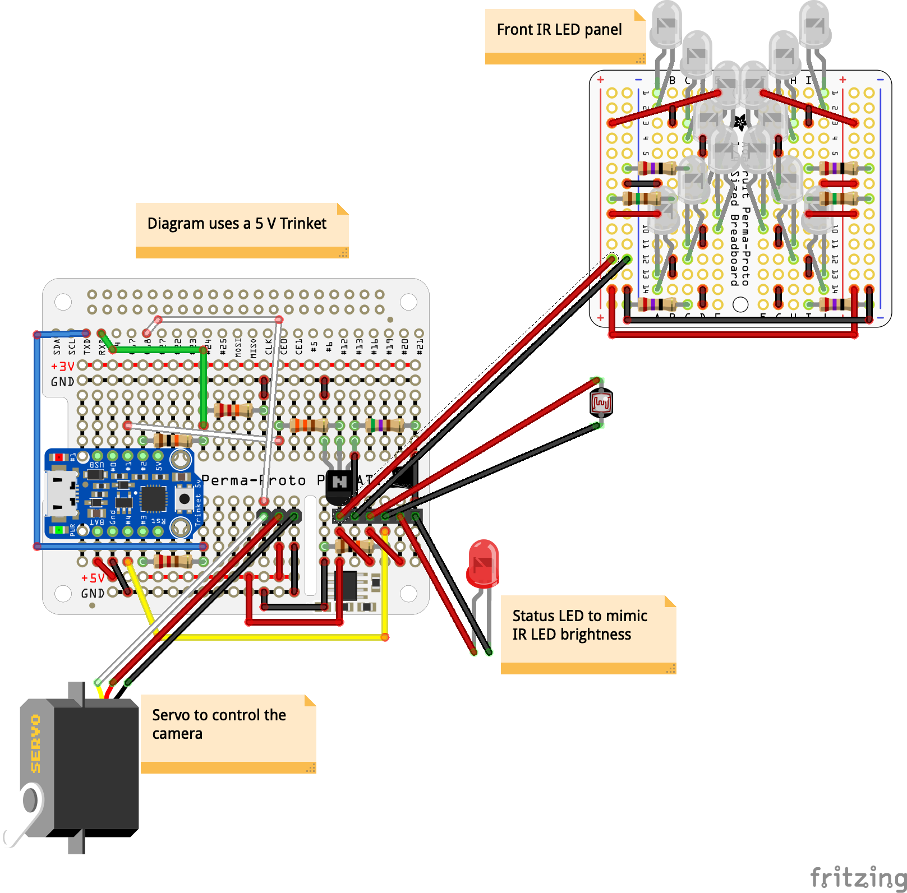

### Protobard schematic

This uses two Adafruit boards:
- Perma-Proto HAT
   - https://www.adafruit.com/product/2310
   - 
- PermaProto Quarter-sized breadboard
   - https://www.adafruit.com/product/1608
   - 
