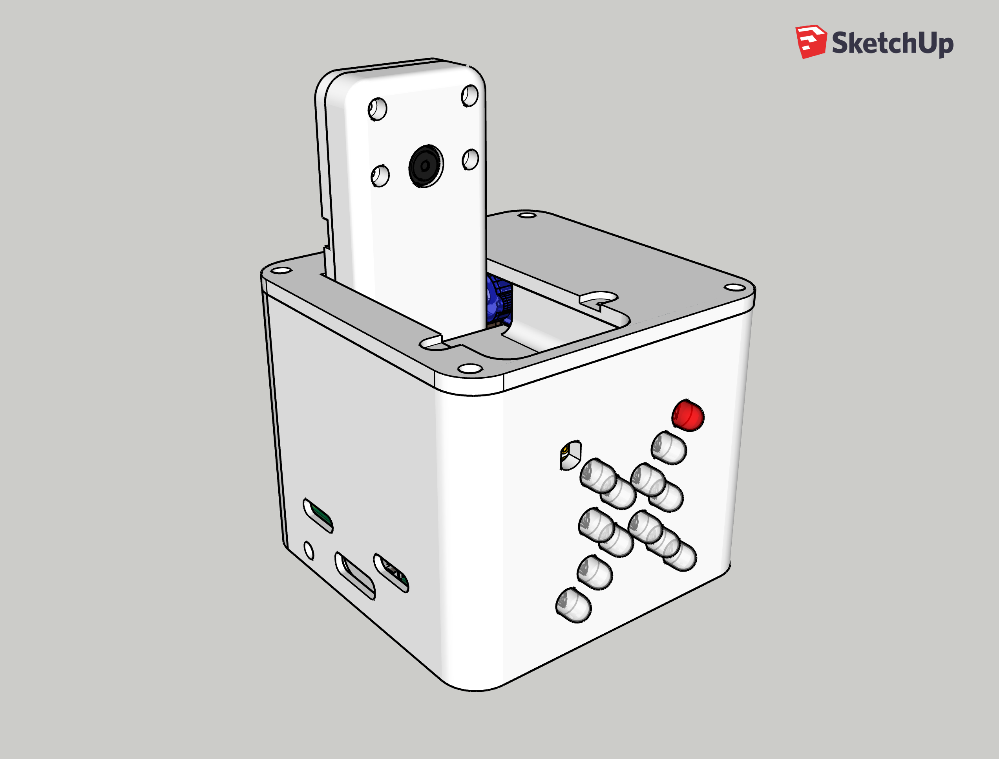
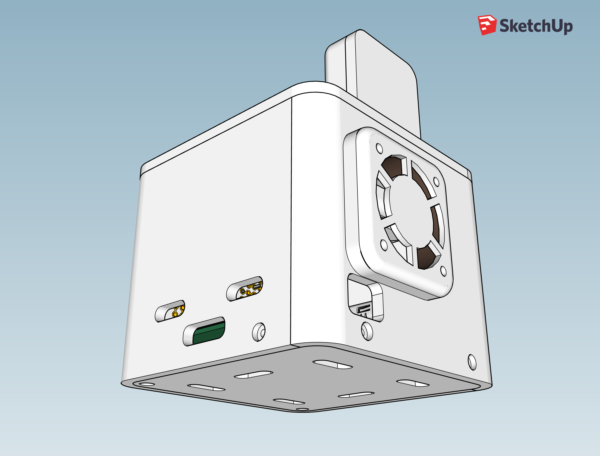
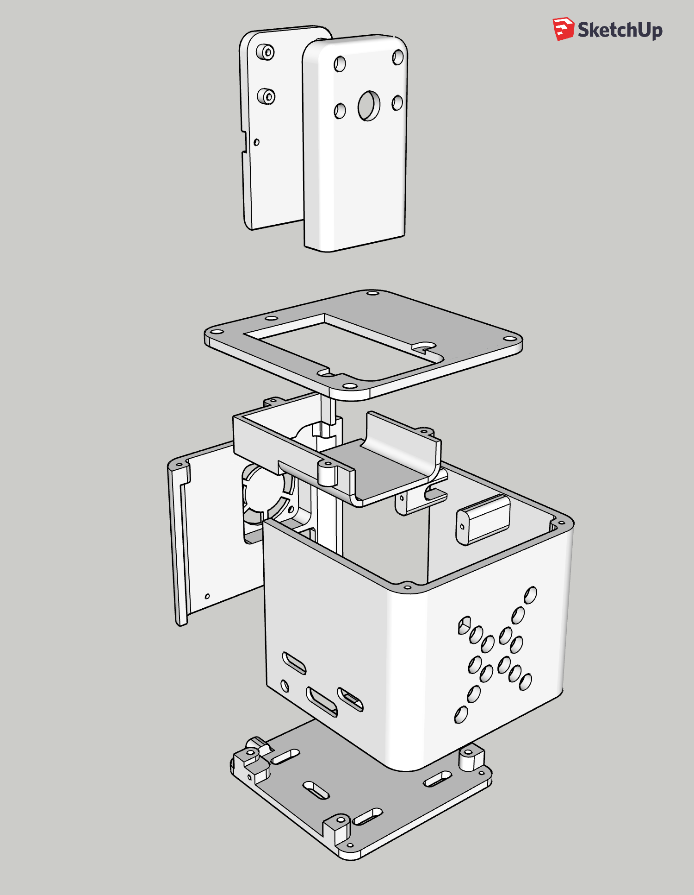
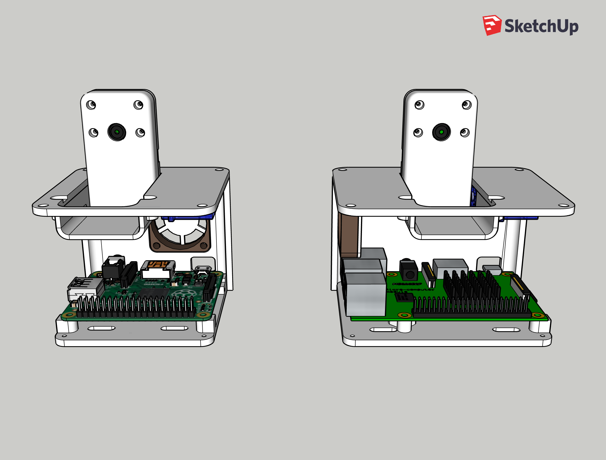
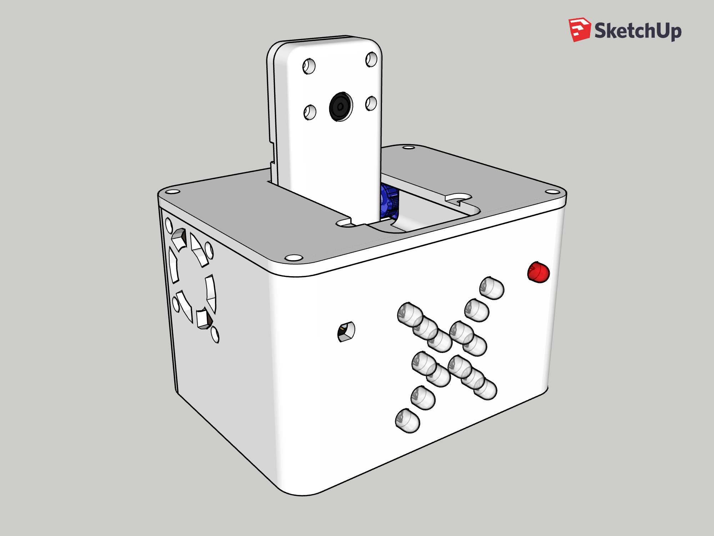
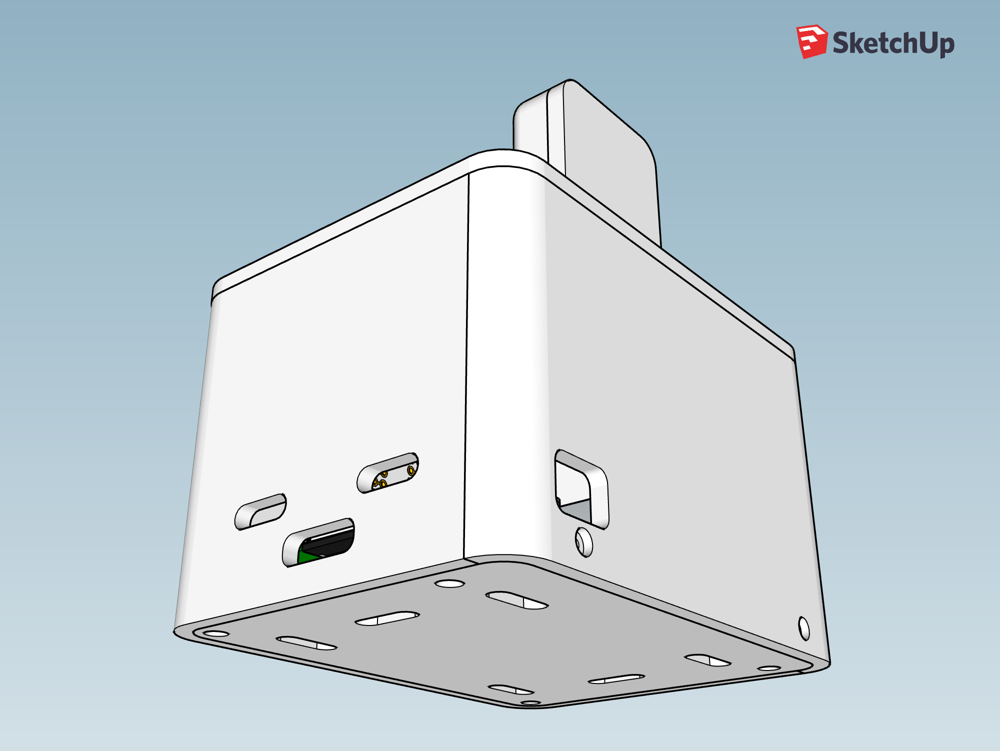
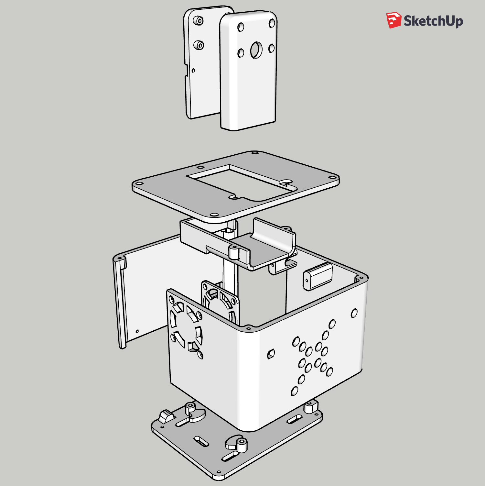
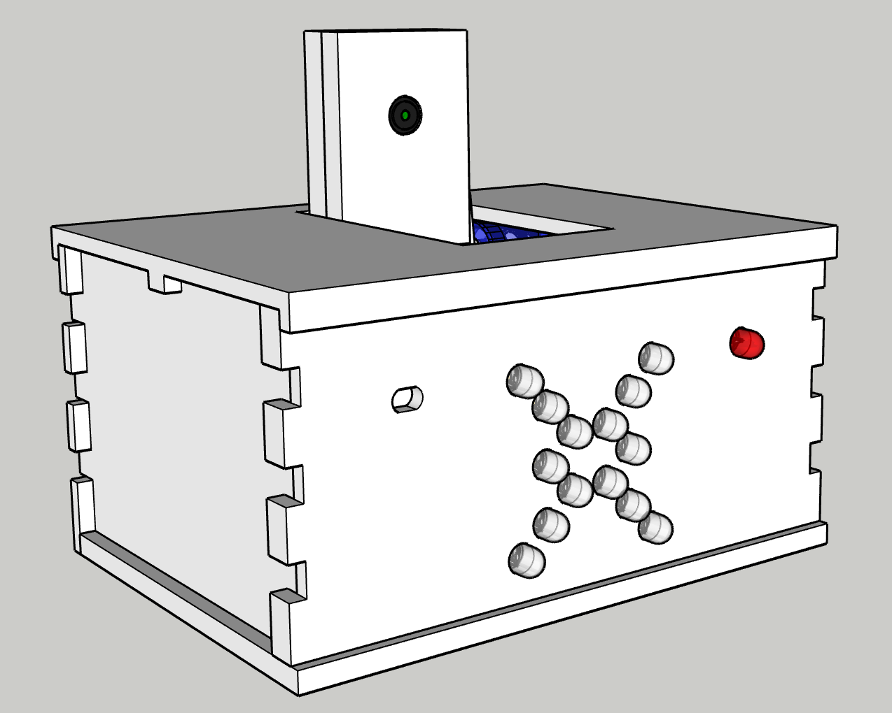
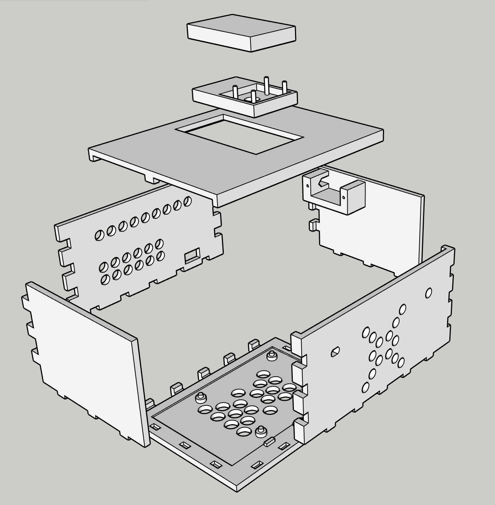

# System case

The cases for Watchtower are housed within their versioned folders here. You can check out the full model of v3 [here](./v3/parts/v3_all_parts.stl).

### All versions:

For extra peace of mind, the camera is connected to a servo which will conceal the camera inside the case when not in use. The case contains holes in the front that match the configuration of the IR panel described in the [hardware section](../hardware).

A mounting cradle for the micro servo is located on the right side panel. The SG92R servo is what I use: https://www.adafruit.com/product/169. The servo will rotate the camera housing to expose the camera when the system is turned on.

The system is self-contained except for a space for the power cable. A Raspberry Pi 3+ is necessary for the on-board WiFi.

### Version 3:

- Designed for the Raspberry Pi 3A+ form factor.
- Roughly 47% smaller than v1 and 22% smaller than v2.
- The photoresistor and status LED have been moved onto the front circuit board. Two front LEDs have been removed to make space.
- The exhaust fan has been moved to the back of the case. Using heatsinks, the fan can cool the SoC from 53C to 38C in 5 minutes in a 70F/21C room while running Watchtower.
- The bottom panel's screws have been moved to make it easier to slide the bottom panel into the case from the rear.
- Air intake vents added to the left side to match the right side.
- **Contains all of the same improvements that were introduced in version 2.**

 

Version 3 and version 2 side-by-side:

### Version 2:

- 32% smaller than version 1.
- Uses M2x6 screws to tightly seal all of its panels.
- Comes with mounts on the left side panel for a 30x30mm fan to cool the system.
- The top panel has a closer seal around the camera's case.
- The servo's mouting gear attaches directly to the camera's case instead of needing to use a plastic arm that comes with the servo.
- There is a cradle underneath the camera that v1 does not have. This keeps the camera mount from being damaged if pressure is applied to the top of the case or if the servo is rotated beyond its closed angle.

 

### Version 1:

This is an obsolete design that's much larger. It doesn't have any protection for the camera if pressure happens to be applied to the top of the case. This can cause the camera to rotate into the case or possibly break from the servo.

 

