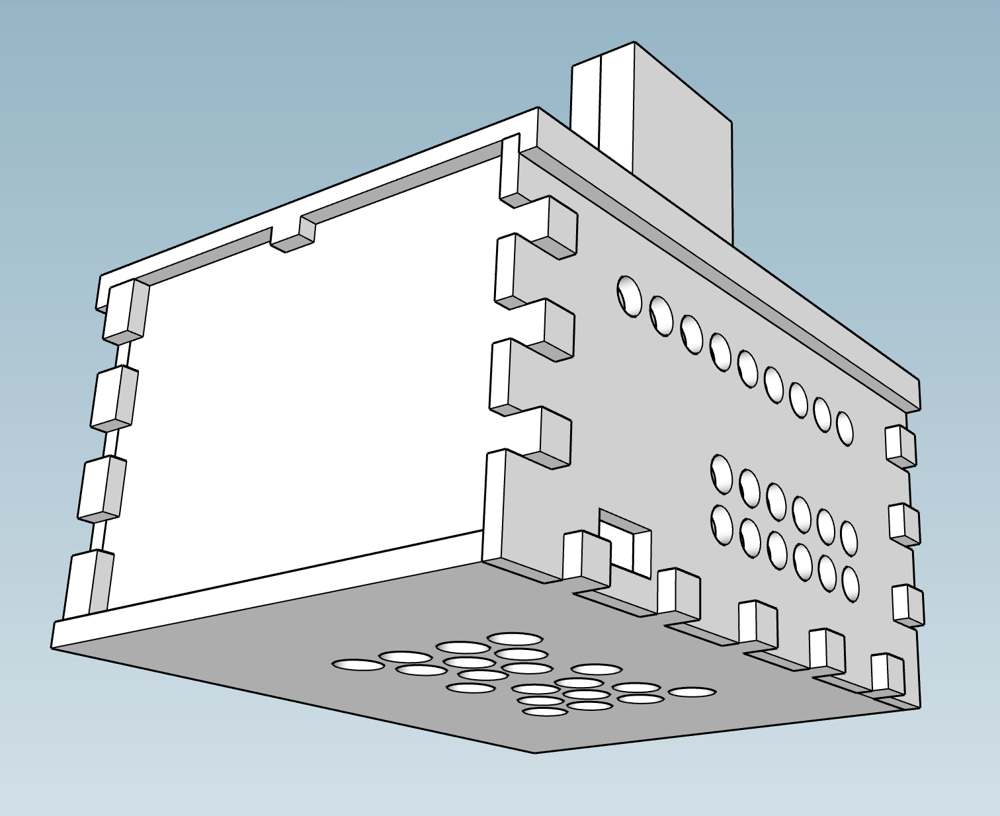

# 3D Case

 

The  file is a case for the security system. It contains holes in the front that match the IR LED panel described in the . The front also contains a spot for the photoresistor and the status LED. The front panel is designed to slide down onto the two side pieces, which makes servicing and installing the front hardware easier.

The case has a mounting cradle for a micro servo on the right side panel. The SG92R servo works well: https://www.adafruit.com/product/169. This servo rotates the top Pi Camera housing 90 degrees to expose the camera when the system is turned on.

**The system is self-contained except for a space for the micro USB power cable.** The left side panel can be removed if you need access to the USB/Ethernet ports. I recommend using a Raspberry Pi 3 since it uses on-board wifi. The SD card is intentionally concealed, but some small adjustments can be made to include an access slot.

